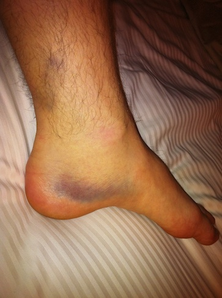
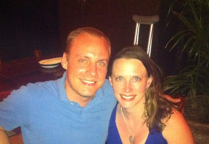
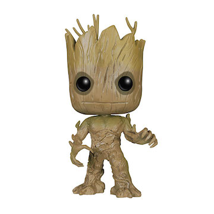

Two years ago, I was forced to reevaluate my identity.

## Adventure

It was SXSW 2012, and I was having fun in Austin. A few days previous, I had just spent time with all sorts of cool Startup Weekend organizers from all over the world at the Startup Weekend Global Organizer Summit. With that over, I was making the rounds at SXSW, hitting party after party, exchanging business cards with people from all over the world.

We were walking from our fourth to our fifth party that Saturday night, March 10th 2012, making our way through downtown Austin. It was quite late, so the dance party and DJ we encountered in the middle of the street was starting to break up. We still danced a little. As we continued exploring, we discovered another group of people in the middle of the street. This time they were playing ultimate frisbee.

With some good alcohol in my system, I jumped right in. I snagged the frisbee out of mid-air as it was passed around, running back and forth. I didn't hold back. I'm not sure how the original set of players took it, but I was having fun.

## A serious injury

Fully in the moment, I ran at a pass, missed it, and found myself out of the game on the sidewalk. I tried to rejoin the action, but nothing happened. I couldn't push off with my left foot. It was just kind of dead. I didn't feel any pain, but there was definitely something wrong.

My friends were moving on to the next bar, so I limped along with them. The festivities finally ran out of steam not long after that and I got a ride home.

The next morning, clarity returned along with pain. I did enough panicked research on my phone to determine that it was likely an Achilles Tendon injury. A friend drove me to an emergency care center, but they couldn't do much other than tell me what I already knew. At least I got a boot and crutches. In the midst of continued SXSW excitement, I was fully out of commission. I ended up sitting at our AirBnB for the rest of the trip. It was nice to to board the plane home first, even if it was bit throbby at altitude.

I put on a happy face, but I was deeply worried. I didn't know if it was fully torn or just partially torn. Fully torn would mean surgery. Either way, the range of recovery times I found when perusing achilles injury-focused message boards ranged between six months and a year. And there was also that reminder of time marching forward: my research found that Achilles Tendon injuries generally happen to men over 30.

## Prognosis

I went to a Physical Therapist after getting back to Seattle, and got the reasonably good news: it was only partially torn. No surgery. But I never got a definitive answer on recovery time. The message boards' timeframes swam in my head. It was unthinkable that I'd be out of commission for so long. But all I could do was focus on the now. The first step was rest, to let it fully heal. Only after that would we build back flexibility and strength.

I was on crutches more than three months, until late June. I was very lucky that I could kind of get around by hopping on my right leg; otherwise I would have had a lot more trouble with buses, cooking for myself, etc. As it was I needed help doing the most basic of things: grocery shopping.

Crutches. Always crutches. Crrrrutches. International travel with crutches. Photobombing crutches.

## Identity

So what does this have to do with identity? Well, I was an athletic person: yoga, weight-lifting, cycling, running, snowboarding, etc. But after the injury, not only did I need to take a four-month break cold-turkey, I started from square one once I started walking without crutches again.

It was a slow process, getting used to walking progressively larger distances. After a while I gained enough strength to use the injured leg with my clutch. Thankfully, not too long later I started riding my bike, regaining a sense of autonomy in my commute. But it was nearly a year later that I first tried running again. And when I did start trying to run, It was a repeated cycle: too-aggressive attempts based on remembered capabilities, injury, rest, resetting expectations, then trying again.

I needed to reconsider my standard answer when I spoke about who I was, what I liked to do. I needed to amend my internal monologue about myself. I realized that I had derived part of my sense of self-worth from that lost athleticism. And I truly mourned the loss of my abilities.

## Non-attachment

> "Most of our troubles are due to our passionate desire for and attachment to things that we misapprehend as enduring entities." - Dalai Lama

We all have key parts of ourselves, key things that we hold very close. That standard answer when someone asks you about yourself. Perhaps you're involved in a lot of things; your identity is large and varied. Or perhaps everyone knows you by one big thing; it's your whole life.

How might we make ourselves resilient to the change we know happens regularly in life? How might we enjoy these things around us during their season, let go just as easily as we grab hold?

What if we all kept, in the back of our mind, this mantra?

> "Strive for a small identity"

## Okay, what does that mean?

It's a different way of thinking about who you are. It's not about building your collection of traits and it's not about proving anything to yourself or others.

A small identity:

* Allows us to value ourselves for simply existing. Nothing more to prove. Less self-judgment. Probably less judgment of others too.
* Is resilient to every change in life, whether catastrophic or a natural part of aging. For example, it weathers the loss of a job with serenity.
* Is nothing but daily actions. It doesn't justify today's behavior based on history's habits (this is called [self-licensing](http://en.wikipedia.org/wiki/Self-licensing)).
* Can speak frankly about and listen openly to inner thoughts and desires, knowing that they do not reflect on the value of the human holding them.
* Cares less about labels of all kinds, including national boundaries, and more about action towards worthwhile goals.

Maybe we all need a little bit of [Groot](http://en.wikipedia.org/wiki/Groot) in us? Who am I? _I am Scott!_

There's still a lot of extra information I usually feel the need to include after that, but I'm trying.

Who are you?
