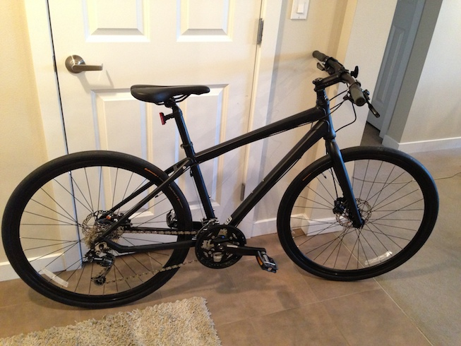
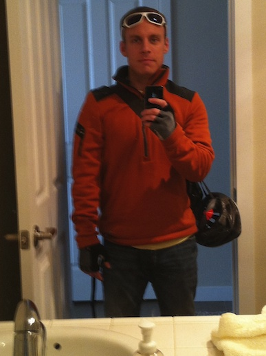
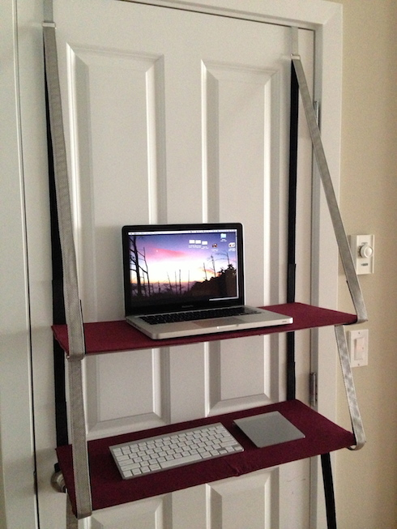
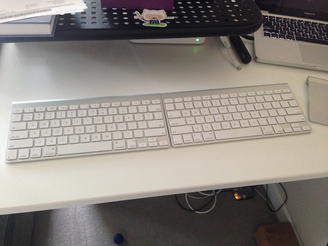

Bikes have been a large part of my life for a long time. But not lately. Before we get into my reasons for that, let's talk about history a little bit...

## Beginnings

When I was a kid, I was on my bike all the time. It was fun to go fast, to make tight turns, to get to friends' houses in the neighborhood. I rode my bike to school most days all the way from 6th Grade until late High School (this is California, so it didn't rain that much). The bike was only retired when my parents gave me their well-loved Audi, just a year younger than I was. Hey, you can't say no to a free car, right?

## Cycling for fitness

My senior year of high school I was working for Hewlett Packard after school every day. I treated it like an important extracurricular. I was building my resume, learning about the working world, and making more than minimum wage, so it made sense to turn down the tennis team that year. But with classes, work, and the drive between them every day, I was sitting a lot. I needed a little more physical activity in my life. My bike, so frequently used in the past, was the obvious choice.

I went on long rides through the hills of Rocklin, CA. It felt good to get out of the house, get the blood pumping, feel like I wasn't sitting there rotting. But it wasn't too long before I decided that the hills were too hard going up, and too easy going down.

## Signs of inflexibility
Over the next several years I found that running solved the problem with too-easy downhills. I had some knee soreness at times, but gradually ramped up with no real problems.

In early 2005 I found myself training for the Portland Marathon with Team In Training. As recommended by the program, I ran a half-marathon that summer for practice. Like a true beginner, I learned a painful lesson about running shirts and their effect on the more sensitive parts of your chest. But the more worrying discovery was that I had to stop and stretch several times due to not-quite knee pain. I thought it wise to consult a physical therapist, since band-aids can only prevent external abrasion.

At my one and only appointment, the primary message was that I needed to strengthen a few key areas and increase my flexibility. We did some exercises I was to continue doing on my own, but I latched onto the easiest quick fix: [IT band](http://en.wikipedia.org/wiki/Iliotibial_band_syndrome) stretches. I'd stand with my legs crossed, then bend to the side, feeling it up and down my leg. Did a bit of the foam roller. It did the job. I had no knee problems during my marathon.

I wasn't interested in addressing the system, just that bothersome symptom. But it wouldn't be long before I was shocked into addressing things more globally.

## Rediscovering cycling

I bought a new bike in the summer of 2009, and with the help of friends I was able to use it beyond the few warm, dry months here in Seattle. Not the friends who wore all spandex when they rode their multi-thousand-dollar carbon fiber road bikes. No, I latched onto the people around me who understood the practical aspects of cycling. Like them I wore mostly street clothes. Fleece and jeans! Rollin' PacNW!

It really helped my commute across Lake Washington to get to Microsoft's Redmond Campus. I had lots of options when on my bike. Where before I had multiple buses to catch, rigid schedules to keep, or high-stress merging, the bike allowed me to jump on a bus whenever. If I felt like it I could add a couple miles and grab a bus closer to the lake, or even bike the 25 miles up and around Lake Washington on the Burke-Gilman Trail.

When I left Microsoft and started working in Seattle, my bike was that much more convenient. I no longer needed a bus at all! I just rode directly to wherever I needed to get to go. 30 minutes to downtown, 45 minutes to SoDo or Capitol Hill. And I was getting exercise!

Pretty awesome deal, right?

## Listening with fresh ears

When I [injured my achilles](/injury-identity-and-non-attachment/) in 2012 I gained a new friend: a physical therapist. It wasn't a one-appointment thing, since recovery was was a many-month ordeal. I got in the habit of taking her seriously, and listening to my body's needs a bit better.

As my injury healed, we started talking about my body as a comprehensive system instead of focusing on individual symptoms. It was same message I had heard years before, but this time I was listening very closely. I was tight in places, weak in other places. I was primed for injury, even more so with advancing age. And there was a pattern to it...

> "Young men trade their health for money; old men trade their money for health" - Chinese proverb (via my acupuncturist)

## Computer posture

After 20 years of sitting at a desk, I had succumbed to the hunched-over, closed-chest posture common to those of us in the technology world. It's not a pretty thing:

- tight hamstrings
- tight hip flexors
- chest is folded inward, overly strong and tight
- back is curved forward, weak and overstretched
- neck is pushed forward, not properly curved

I did the prescribed injury recovery exercises, but we added more and more posture-focused exercises.

We talked about my work setup. She said that the right chair and mindfulness toward good posture can put you on the road towards balance. But there was bad news: working on a laptop with no additional assistive devices guarantees that you're not in the right posture. And it's damn common. It's the vast majority of people in coffee shops and coworking spaces.

So decided to jump all the way in with a standing desk. Standing all day was tough at the start, and I needed breaks. But my posture was improving. Slowly. I couldn't expect fast progress; I was undoing __20 years__ of bad habits.

## Cycling and posture

After nearly a year of changes to my work area, including moving to dual keyboards, I realized that there was one major posture-impacting holdout. There was still time each day that I was hunched over, and I could feel it in my neck after every ride. It was the cycling.

When I brought it up, my physical therapist slumped her shoulders a little bit. She had some exercises I could do, but they would simply reduce the negative impact of cycling. And I already had some bad habits: a too-curved back, not using my hamstrings enough as I pedaled.

That was when it clicked in my head. I had seen the pattern around me - lots and lots of people in the tech world riding bikes. But the similarity in body position between using a computer and riding a bike was now painfully clear.

So I decided to take the plunge. No cycling for a while. It wasn't an easy decision, but I had very good reason for it. It's part of a comprehensive set of changes I've made in the last couple years:

## Exercises for posture Improvement

- I do at least 10 minutes of yoga every day to build hamstring and hip flexibility.
- I lay on [back-molding blocks](http://www.postureresources.com/shop/fulcrums/) 10 minutes per day. This helps to put my neck and back in the right position, with the right curvature. You can also do exercises on the blocks to strengthen.
- My exercise routine strengthens my back (rows and similar exercises), and includes no chest exercises. I haven't done a push-up or benchpress since March 2012.
- I regularly stretch my fingers backward and loosen my shoulders with arm circles, since my arms, from wrists to shoulders, are tight from typing all day.

## Work area changes for posture

- I use a standing desk at home, and a [travel standing desk](http://www.ninjastandingdesk.com/) for the road. It's a big change, but it's generally easier to maintain the right posture from the feet up instead of from the butt up. It's also diagnostic: If you get really tired standing, it's a sign that you could improve your posture. I also find that it's easier stay loose at a standing desk, put my leg up on something, roll my feet on a ball, stretch, whatever.
- Middle of monitor at eye height for correct neck position
- Two keyboards to open the chest, push shoulders back. It's a more neutral position.
- Minimize working directly on laptop. I work in coffee shops sometimes, but no more than one day a week.

## Will I cycle again?
One of these days I'll meet my flexibility goals and jump on a bike. But it's a long journey back to balance.

I'd love to hear about your efforts and progress!

---

Further reading:

- I heartily recommend my talented physical therapist, [Adina DeSantis](http://adinadesantis.com/)!
- Check out my friend Larry Swanson's [Scared Sitless site](http://sitless.com/) for some healthy office fitness habits
- If you do plan to continue cycling a lot, start [stretching](http://www.bicycling.com/training/fitness/best-stretches-cyclists). This is especially key to remember for those of you commuters - leave time for stretching!
- I've got a cheap little standing desk setup: an
[Ikea adjustable height desk](http://www.ikea.com/us/en/catalog/products/S89806740/#/S59860229)
and [bed risers](http://www.amazon.com/gp/product/B003M8GI4O/ref=oh_aui_detailpage_o02_s00) for a little extra height
- Using multiple bluetooth keyboards in OSX requires software to force control keys from one keyboard to affect the other keyboard. Doesn't work in password fields. https://github.com/mejedi/my-multiple-keyboards

