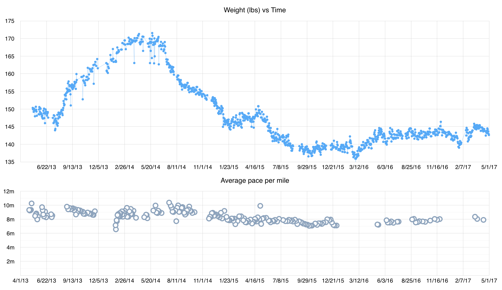
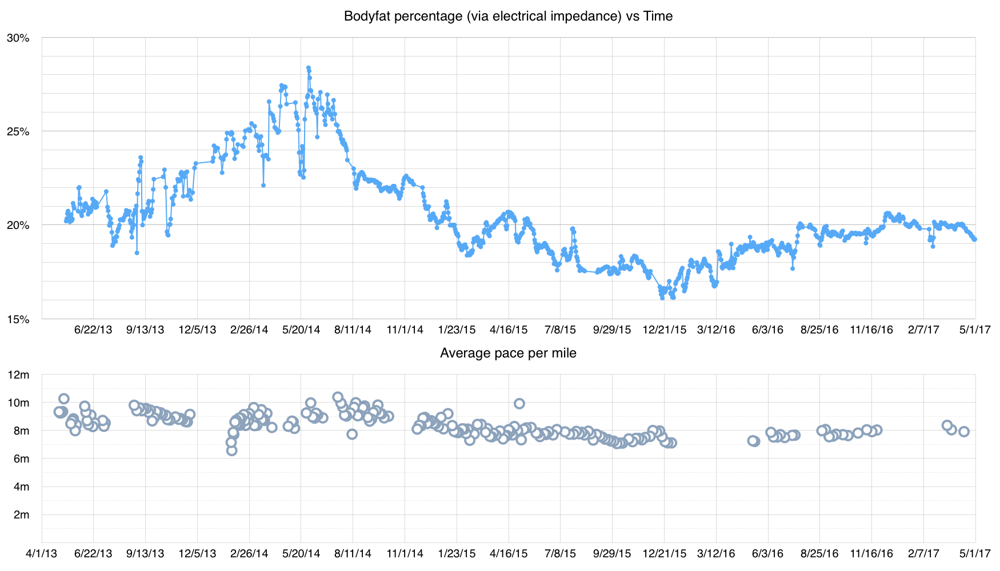
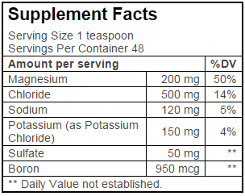

It's been a while since I last talked about nutrition, fitness or health. I think it's time. Where before my articles about this have been [focused on](/a-running-update/) [one aspect](/a-35lb-weight-swing-in-two-years/) [of health](/hippie-experiments/), this article will cover it all. It makes sense though - it's reflective of my more holistic approach these days.

## Considering the whole

As an analytical thinker, my first inclination has always been to break up the problem. Solve each individual area, and then the whole will be solved.

But as I get older I realize that solving an individual area will often throw the whole out of balance. Get really good at running and you might find that your allergies get worse, like mine did after my marathon in 2005. Take your body fat percentage down to the minimum, and your athletic performance might suffer.

Let's take a look at some of my explorations and wins...

## Weight vs. Exercise

Last year, when I published my ['35lb weight-swing' article](/a-35lb-weight-swing-in-two-years/), I had just come through a period of my lowest body fat percentage in quite a long time. It had originally swung up along with my 'high everything diet' then back down as I fine-tuned my habits. And in late 2015 I spent about a month in the 16-17% range after consistently trending down for a few months.

My acupuncturist was a little bit worried. Any kind of quick change is worth a closer look, but this was combined with new territory. She didn't tell me to do anything specific, but did wonder if I was overtaxing my body. I took this to heart. After all, I was pursuing total health, not some sort of magazine-ready chiseled physique.

So, I stopped working out in early January 2016. No runs, no lifting, no yoga. Just a walk through the neighborhood every day.

Can you tell when I started working out again? Basically that low point in March. After two months, I think I was starting to lose some muscle. I took it as a sign, and started working out again. I moved past stretches, yoga, and strength training several weeks later, adding short runs. I eased into it to ensure I didn't overtax my body this time.

Once I started moving my body a bit more, I stabilized between 140 and 145, where before I had dipped below 140.

It's good to be stable. And it's good to zero in on the right level of activity.

## Body fat percentage

With all that analysis into my weight, you may be wondering what happened to my body fat percentage during this time. It mostly follows the curve above:

[As before](/a-35lb-weight-swing-in-two-years/#the-high-everything-diet), there are interesting blips in the data which aren't reflected in the weight chart. Because this data is collected via electrical impedance, food can affect it a surprising amount, and very quickly. For example, [my records](/a-system-for-2015/) tell me that the jump from ~16.5% to ~18% in mid-March came (in part) from a brownie with ice cream.

No, it didn't actually add that much fat overnight - it's the conductivity changes it caused!

## 40,000 volts

My bodyfat numbers stayed surprisingly high and surprisingly stable for the latter half of the year, and I have a theory as to why. In August I discovered a mineral supplement called [40,000 Volts](https://traceminerals.com/40000-volts/).

I add it to a glass of water when plain water doesn't taste good.

It's hard to explain, but plain water sometimes seems like it is taking something from me, where water with 40,000 Volts seems like it is giving something. I wouldn't always say that that something given is the right thing, but it's a really good option to have. I drink it whenever I feel like it, or when I sweat a lot, or when I eat something really salty. It helps balance me out.

It does seem like its effect on my electrolyte balance keeps my body fat percentage higher than it would be normally. I'm cool with that.

## Digestion

Another tool I brought to bear in August helps me digest tough meals. I take a [full-spectrum enzyme](http://www.sourcenaturals.com/products/GP1111/) whenever I eat food out of the house. Restaurant food is often so rich with fat, sugar, dairy, and salt that I find a little bit of help welcome.

I even use it at home when I know the food will be hard to digest. Say, for example, it's a special occasion and I'm about to eat some [ice cream](http://threetwinsicecream.com/). Even if it's not at a restaurant, even if the ice cream is a known quantity. Chinese medicine says that cold things, and dairy not in yogurt or hard cheese form, are especially challenging.

Speaking of chinese medicine perspectives, I continue to use a number of foods to avoid dampness: celery (snack), barley (breakfast), rye (toast), carrots (cooked), asparagus (grilled), etc.

## Allergies

I've even done a few experiments with foods on my 'slightly allergic' list. I can handle oats and mushrooms in small quantities just fine! I look forward to trying some of my higher-impact foods later this year.

For now, however, I'm still recovering from spring pollen here in the Northwest. Last year in May I was hit with the full brunt of local tree pollen, and the same holds true this year. Down for the count for a good week. Maybe next year I can avoid such a substantial impact.

I have hope, because I was able to avoid my standard sickness last November. It's very clear from [my logs](/a-system-for-2015/) that November is a tough month for my health. Every November on record includes some mention of sickness. But with all the tools at my disposal, all of my recent learnings, I was able to avoid any kind of sickness this last winter! There were some days that month where I felt very tired, needing to go to bed early. But it never flared up into full sickness. It's a big win for all my recent diet and lifestyle changes!

## Energy levels

The thread weaving its way through all of these topics is that of energy. A workout taxes your body, we all know that. And sleep restores it.

But I've found that some surprising things contribute to my energy levels:

* Digestion demands a whole lot of energy, especially those rich meals.
* Alcohol is quite costly, slowing everything down.
* Acupuncture treatment itself uses a lot of energy, like a moderate workout.
* Staying up later than normal results in a net loss of energy, even if I sleep in.
* Mental focus is surprisingly costly. Even if I don't necessarily feel it physically or mentally at the end of a day, my body will express it somehow.

It's important to identify these key areas, because Chinese Medicine has a very wise recommendation about energy usage: _plan to use only 70% of your capacity_. Whatever is left over is then used to ensure you remain healthy over time.

It's like that recommendation to have X months of savings at any given time. It's a good way to manage risk.

## Listen!

With health, it's mostly a matter of [listening](/first-listen/). Paying attention to your body. Don't mindlessly appeal to some sort of standard, framework, ruleset, or schedule. Even if you originally came up with it. Listen to what your unique body needs at this unique moment.

I know I'm trying to listen better!
