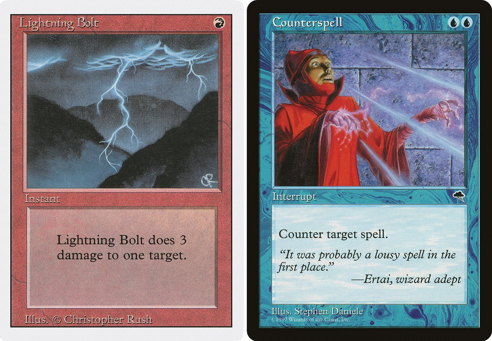
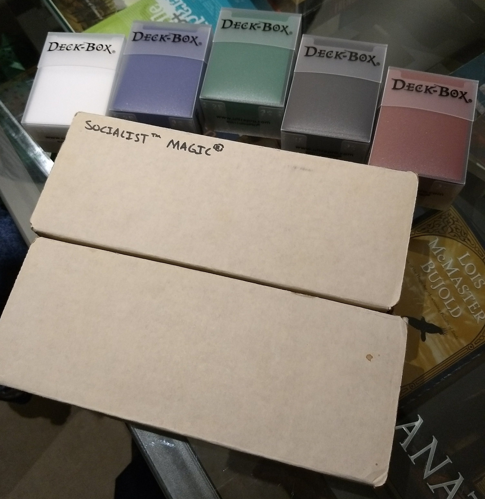
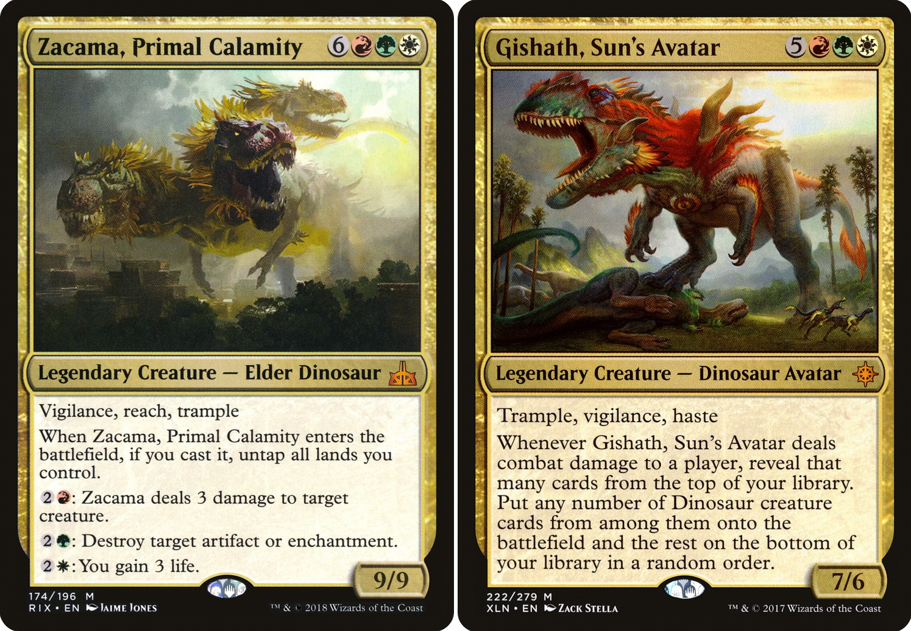
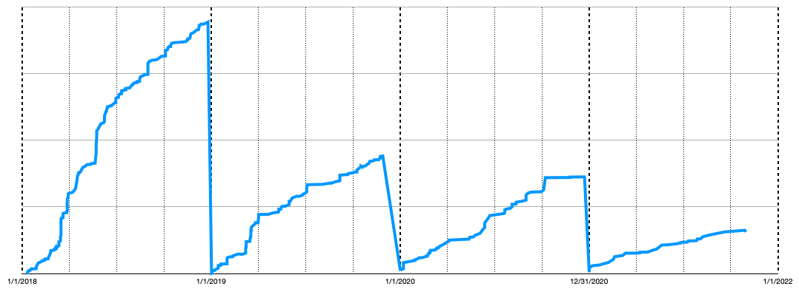

_Magic: The Gathering_ is a fun and amazingly deep game. I have a lot of fun with it. But I went really deep. Probably too deep. Let's talk about how I got in, and how I took a step back. Maybe you can learn from my story, as well as my [recommendations for beginners](/magic-the-gathering/#recommendations-for-getting-into-magic)!

## Early leanings

In 1995, when I was a freshman in high school, two collectible card games were vying for dominance: _[Magic: The Gathering](https://magic.wizards.com/en)_, and _[Star Wars: Customizable Card Game (SWCCG)](https://en.wikipedia.org/wiki/Star_Wars_Customizable_Card_Game)_. Before [I got into _SWCCG_](/star-wars-cards/), I remember playing with my friends' _Magic_ cards, [Prodigal Sorcerer](https://scryfall.com/card/5ed/112/prodigal-sorcerer) among many other classics. But my parents thought _Magic_ [went against their beliefs](https://scryfall.com/card/lea/131/unholy-strength). And so, it became something I only saw from afar, played alongside me and my _SWCCG_ cards in the back of the card shop.

I got a chance to dig in a few years later. Away from my parents in San Luis Obispo for college, I used some of my meager student funds to buy bulk packages of cards, and even a few pristine packs to rip open. We only had a small, communal collection ("Socialist™ Magic®"), but my roommates and I played regularly - usually single-color decks with no _[artifacts](https://mtg.fandom.com/wiki/Artifact)_ to reduce the competition for any card that could be shared. Occasionally we'd do something special, and cannibalize those decks to make two-color combinations.

By my Junior year of college, _Magic_ was largely forgotten.

Several years later, I started playing board games with my [Microsoft](/12-things-i-learned-from-microsoft/) colleagues (like [Ticket to Ride](https://en.wikipedia.org/wiki/Ticket_to_Ride_(board_game)) and [Settlers of Catan](https://en.wikipedia.org/wiki/Catan)), and the topic of _Magic_ came up. I dug my old boxes out of the closet, brought them to the next event, and realized that I was way out of my league. At that point, _Magic_ felt like something I'd never dig into.

## Finally giving in

It was late 2017, and I had been talking about my _SWCCG_ cards for a few years now. But that discussion mostly seemed to bring up _Magic_ with my friends. It was a better game, they said, with a more elegant design. They were waiting for me to join in and play!

The stage was set.

The fateful moment was Christmas 2017. My partner got me a ready-to-play _Magic_ product: [Duel Decks: Merfolk vs. Goblins](https://magic.wizards.com/en/products/duel-decks-merfolk-vs-goblins). It felt familiar, given my previous experience - the basic rules hadn't changed. We played the two decks against each other a few times, and it really whetted my appetite!

From there, I bought more [prebuilt decks](https://magic.wizards.com/en/products/explorers-ixalan), [sleeves](https://www.youtube.com/watch?v=rp8NhzvtLCo), [deck boxes](https://www.youtube.com/watch?v=8CCgxtcUK-o), even a large [4000-card bulk package from EBay](https://www.ebay.com/sch/i.html?_nkw=mtg+bulk) like the days of old. The [sorting was quite familiar](/star-wars-cards/#out-of-print-collectibles)! When I realized that [dinosaurs](https://scryfall.com/search?q=t%3Adinosaur+date%3E%3Dxln+not%3Areprint&order=released&dir=asc&as=grid&unique=cards) were actively being printed in the latest sets, I also picked up [Ixalan](https://magic.wizards.com/en/products/ixalan) and [Rivals of Ixalan](https://magic.wizards.com/en/products/rivals-ixalan) packs from [Card Kingdom](https://www.cardkingdom.com/), my local game store here in Seattle.

It felt good to crack packs and explore a new world. Many thousands of cards had been released since I last played! And it was so satisfying - each [deck was like a little program](https://www.youtube.com/watch?v=pdmODVYPDLA), and there were so many decks to build!

But most importantly, lots of people were actively playing. Unlike _SWCCG_, a huge amount of _Magic_ content was being released every week on [YouTube](https://www.youtube.com/results?search_query=mtg). Stores were regularly holding _Magic_ events. And a friend was continuing to encourage me, giving me more duel decks, loose cards from recent pack-opening, and finally, two full _[Commander](https://magic.wizards.com/en/content/commander-format)_ decks: [Built from Scratch](https://magic.wizards.com/en/products/card-set-archive/commander-2014/built-from-scratch) and [Guided by Nature](https://magic.wizards.com/en/products/card-set-archive/commander-2014/guided-by-nature).

## Finding my formats

If I thought one-on-one 60-card games of _Magic_ were interesting, four-player _Commander_ ([also known as _EDH_](https://tappedout.net/mtg-questions/what-is-the-difference-in-edh-and-commander/)) truly sucked me in. I watched a lot of _[Game Knights](https://www.youtube.com/playlist?list=PLyLzs6vB3Xk75kjIm45DQLrR8oT63_OvD)_, played a few games with friends, and was totally hooked. The format has so many things to love: the swings back and forth in player advantage, big splashy plays, the metagame of the politics between four players, so many [potential deck themes](https://edhrec.com/themes) to explore, and even the high variance between games due to a maximum of one copy of each card in the deck.

The decks were still programs, but bigger: 100-card singleton decks. Everything was a lot more exciting!

After playing a little with the decks I had been given, I bought my first two commander decks ([Vampiric Bloodlust](https://mtg.fandom.com/wiki/Commander_2017/Vampiric_Bloodlust)/[current version](https://tappedout.net/mtg-decks/commander-mardu-vampires-2/) and [Draconic Domination](https://mtg.fandom.com/wiki/Commander_2017/Draconic_Domination)/[current version](https://tappedout.net/mtg-decks/commander-five-color-dragons-1/)) and started tweaking. It was engrossing, exploring the 20-thousand card back catalog! And there were so many resources available online! [Gatherer](https://gatherer.wizards.com/) then [Scryfall](https://scryfall.com/), [mtgsalvation](https://www.mtgsalvation.com/), [edhrec](https://edhrec.com/), and even [YouTube with full deck techs](https://www.youtube.com/watch?v=WVtqB-894lI).

Not long after, I built [my first Commander deck from scratch](https://tappedout.net/mtg-decks/commander-naya-dinosaurs-1/). Yes, it was dinosaurs again.

[Thanks to](https://www.youtube.com/channel/UC7-hR5EfgpM6oHfiGDkxfMA) [The Professor](https://www.youtube.com/watch?v=J7qQXP-Qk9E&list=PLvqw7t0kbGX96qIqeharIJ9O25lhYFCti&index=1) of the [_Tolarian Community College_ channel on YouTube](https://www.youtube.com/playlist?list=PLvqw7t0kbGX96qIqeharIJ9O25lhYFCti), I also found a good format for the one-on-one games I was still playing: _[Pauper](https://magic.wizards.com/en/game-info/gameplay/formats/pauper)_. Like _Commander_, it has an immense card pool available including all cards printed since 1993, and no rotation. Lack of rotation means you can make a deck and continue to play it over a long period - unlike _[Standard](https://magic.wizards.com/en/content/standard-formats-magic-gathering)_, which forces you to heavily change or even abandon decks [every year](https://whatsinstandard.com/).

_Pauper_'s key limitation is that each card needs to have been printed at the [common](https://mtg.fandom.com/wiki/Common) rarity at some point. This means that even [top-tier decks are less than $100](https://www.mtggoldfish.com/metagame/pauper)! The rest is normal: 60-card decks, a maximum of four copies of any land which isn't [basic](https://scryfall.com/search?q=t%3Abasic).

I had a plan. _Commander_ as much as possible, three to five people per game. For one-on-one games, mostly _Pauper_. Some _[Sealed](https://magic.wizards.com/en/articles/archive/lo/sealed-deck-2014-09-15)_ and _[Draft](https://magic.wizards.com/en/articles/archive/how-play-limited/how-booster-draft-2016-04-05)_ too, but mostly for special occasions.

## An arc of addiction

By the end of 2018 I had 15 _Commander_ and 15 _Pauper_ decks built. I had explored [Eldrazi](https://tappedout.net/mtg-decks/commander-colorless-eldrazi-1/), [Ninjas](https://tappedout.net/mtg-decks/commander-yuriko-2/), made a strange [coin-flipping deck](https://tappedout.net/mtg-decks/commander-okaun-zndrsplt/), and discovered my love of [tokens](https://tappedout.net/mtg-decks/commander-najeela-1/).

By the end of 2019 I had 25 _Commander_ and [21 Pauper decks](https://tappedout.net/users/scottnonnenberg/mtg-decks/?name_contains=pauper&order=name) built. My _Pauper_ [battle box](https://www.reddit.com/r/mtgBattleBox/) covered most of the top decks in the _[Pauper metagame](https://www.mtggoldfish.com/metagame/pauper)_. I had explored mono-color _Commander_, making [a](https://tappedout.net/mtg-decks/commander-oketra-1/) [deck](https://tappedout.net/mtg-decks/commander-nezahal-1/) [of](https://tappedout.net/mtg-decks/commander-josu-vess-1/) [each](https://tappedout.net/mtg-decks/commander-neheb-3/) [color](https://tappedout.net/mtg-decks/28-08-19-commander-selvala/).

Finally, in early 2020 I slowed down, stopping at [30 Commander decks](https://tappedout.net/users/scottnonnenberg/mtg-decks/?name_contains=commander&order=name). It was at that point I considered my _Commander_ collection done - after I had made a final expansion into themes and color combinations I hadn't previously covered, like [Gruul X-spells](https://tappedout.net/mtg-decks/commander-rosheen/), [Orzhov life manipulation](https://tappedout.net/mtg-decks/commander-selenia-1/), and [Dimir Mill](https://tappedout.net/mtg-decks/29-01-20-commander-phenax/).

I put a lot of time and effort into these decks. Analyzing and optimizing, then studying new cards as they were released to see if they applied to any of my decks.

And of course, I wrote code to help me manage my collection, to inventory cards, fetch prices and card images, diff decks to generate a change history, and much more.

It was an endless cycle.

Nearly.

The key to ending it was to figure out how much was 'enough.' How many decks can I really play in the span of one year? If I modify even half of my decks with each new set release (5-7 times per year), can I play each of those decks often enough to guarantee that I play the new cards? Are the new cards added to my decks even increasing the fun I have?

It was important to determine 'enough' because _Magic_ is expensive: both in **time** and **money**. The time I spent with _Magic_ was one of the big reasons I've posted so little on this blog since 2017. And I have my spreadsheets tracking spending - despite the existence of a whole community of [people using Magic cards as speculative investments](https://www.reddit.com/r/mtgfinance/), I really felt the need to reduce my spending over time, not increase it. I'd like to think I've done a reasonable job:

## Magic in the time of quarantine

COVID was particularly frustrating for my _Magic_ aspirations. It's an in-person game, often played in communal spaces often with total strangers. In March 2020 I had just gotten to a really good stopping point with my deck collection, and was playing Commander with a regular playgroup for the first time.

It took me a while to figure out how to operate in this new environment. My playgroup disbanded; we hadn't built up enough momentum to justify the effort to try to continue playing into the quarantine.

First, I went deep into _[Magic: The Gathering Arena](https://magic.wizards.com/en/mtgarena)_, since it was an easy way to get my fix. It helped to distract from all the bad news. But I quickly learned that like paper _Magic_, it was going to be very expensive to play. And unfortunately it was worse: unlike the normal magic ecosystem, you can't buy individual cards. There is no such thing as [budget brews](https://www.mtggoldfish.com/articles/search?tag=budget+magic), unless they use zero rares. In _Arena_, wildcards of a specific rarity are required to get cards of the matching rarity - and as you might expect rare and mythic wildcards are quite difficult to procure since you can't directly buy them!

But I decided to fully engage with it. I played _Draft_ quite heavily, trying to get as efficient as possible in my collecting. Once I finished collecting [Zendikar Rising](https://magic.wizards.com/en/articles/archive/card-image-gallery/zendikar-rising), I had a copy of every card in standard. I could make any deck!

But over the next few months I realized that it felt like work - I had [daily quests](https://magicarena.fandom.com/wiki/Quests) and [daily win quotas](https://mtgazone.com/daily-wins/), and achieved them. During quick draft availability, I needed to do _a lot_ of drafting, as in two or more drafts per day! It was stressful, and I wasn't even trying to climb the competitive ladder.

The key was a missing component of _Magic_ - **The Gathering**. _Arena_ doesn't have any of the social interaction an in-person game would. And it doesn't support multiplayer formats, my preferred approach. What's more, even if I did pull a friend in to play one-on-one in _Arena_, they'd have to go through the same grind I did to get the cards! I lend decks to friends all the time, and this concept doesn't exist in _Arena_!

## Getting to a good rhythm

In early 2021 I kicked the _Arena_ habit after a friend invited me to play a board game on _[Tabletop Simulator](https://www.tabletopsimulator.com/)_. I saw how well it replicated the experience of playing [Betrayal at House on the Hill](https://boardgamegeek.com/boardgame/10547/betrayal-house-hill) with my friends, and quickly found [Steam Workshop](https://steamcommunity.com/workshop/) plugins which [imported Magic decklists](https://steamcommunity.com/sharedfiles/filedetails/?id=2163084841&searchtext=mtg+import) and [provided a familiar playing surface](https://steamcommunity.com/sharedfiles/filedetails/?id=2050465528&searchtext=mtg+commander+table).

This was it! With my decks imported, it was a faithful replication of what it felt like playing with my friends. Just like when they would come over and play with my decks, I could invite them to the simulator, host a game, and virtually hand them my decks. We could chat over the game, and focus more on fun than the win!

It was a turning point for me in the quarantine, honestly. I felt like a bit of normalcy had returned. Four-player and one-on-one games, with the feel of just a table, some dice, and the cards.

By the end of 2021 I was in a good place. I was no longer part of the MTG hype cycle, with new cards being previewed all the time. I wasn't buying many new cards because my decks were all in good shape. But I was playing with my friends.

It was a sustainable rhythm, finally. The culmination of a process starting in early 2018.

## Recommendations for getting into Magic

Maybe you're interested in playing some _Magic_? Let me give you the advice I wish I had when I was first getting started.

To start, _Game Knights_ is really fun to watch, yes, but it's quite a shock to realize that the decks featured are really expensive! It's not uncommon to see [original dual lands](https://scryfall.com/search?q=set%3A2ED+t%3Aland+r%3Ar) played, each over $300. Maybe you can work up to that eventually, but you really don't need decks like those to have fun!

I think you should start here:

* _[Magic: The Gathering Arena](https://magic.wizards.com/en/mtgarena)_ - If you're a true beginner, it's useful to cover the basics of the rules and mechanics. Just don't spend money on packs or bundles! Don't get sucked into the daily grind. Get up to speed with the rules and get out!
* [Card Kingdom Battle Decks](https://www.cardkingdom.com/ck-exclusives/battle-decks) - These are $10 each and give you a great taste of basic magic gameplay and deck synergies. Get two and play them against each other with your friends and family, and expand from there. With 10 of these, you already have 45 different potential one-on-one combinations!
* [Preconstructed Commander decks](https://www.tcgplayer.com/search/magic/product?productLineName=magic&page=1&view=grid&ProductTypeName=Sealed%20Products&setName=commander-zendikar-rising%7Ccommander-2021%7Ccommander-2020%7Ccommander-innistrad-crimson-vow%7Ccommander-innistrad-midnight-hunt%7Ccommander-kaldheim%7Ccommander-adventures-in-the-forgotten-realms%7Ccommander-2019%7Ccommander-2018) - These are official _Magic_ products which can cost as little as $16, and are playable right out of the box. You can play them one-on-one too, though they are designed for multiplayer. These are pretty low-power.
* [Commander's Quarters](https://www.youtube.com/playlist?list=PL4ZLkBedSzY9X46YeZeHm9FHp6CxzJMu0) - This YouTube channel regularly posts deck videos showing powerful and fun _Commander_ decks available for as low as $25. These are higher-power.
* [Buy singles!](https://twitter.com/martypunker/status/1324925233049055233?s=20) - There's a temptation to give into the gamble - you might open expensive cards in your booster packs, and you might get what you want! Don't do it. Don't buy booster boxes or packs unless you explicitly plan to _Draft_. Instead, buy singles. All the major card sellers have extensive singles in stock and easy single/multi-search: [Card Kingdom](https://www.cardkingdom.com/catalog/magic_the_gathering/search) ([deck builder](https://www.cardkingdom.com/builder)), [TCGPlayer](https://www.tcgplayer.com/search/magic/product) ([mass entry](https://www.tcgplayer.com/massentry)), and [Channel Fireball](https://channelfireball.com/magic_the_gathering/search) ([multi-card search](https://channelfireball.com/multi-card-search))
* [Jumpstart](https://mtg.fandom.com/wiki/Jumpstart) - if you really want the feeling of opening packs, and you're pretty new, this is a ready-to-play booster box. [One booster box comes with 24 packs](https://www.tcgplayer.com/product/214821/magic-jumpstart-jumpstart-booster-box?Language=English). Open two packs, shuffle them together, and you have a deck you can play! And if you [keep the packs together](https://www.youtube.com/watch?v=ry4BYaNRky4), you can come back and re-play with new pack combinations for a totally new experience.
* For [deck boxes](https://www.youtube.com/playlist?list=PLvqw7t0kbGX_hVPvM-koIudA89exy5HWZ), [sleeves](https://www.youtube.com/playlist?list=PLvqw7t0kbGX9ZlOrr9sqD8zGGPuEIfeBz), and [playmats](https://www.youtube.com/playlist?list=PLvqw7t0kbGX-nRzGYQYTDkmkSeY3kd9IB) the The Professor of Tolarian Community College has [a great consumer-focused perspective on most Magic products](https://www.youtube.com/playlist?list=PLvqw7t0kbGX8f-uNgZJkzf1BbcrXvw1EF). He's also got a [great set of tutorials](https://www.youtube.com/playlist?list=PLvqw7t0kbGX_w_HxyEq2DGzLpuATyxgKi) for beginner and intermediate players.

Once you do start, momentum builds. It's easy to go too deep in collecting by yourself, or with others via an arms race. Set expectations and set budgets.

And remember there's a massive card pool - [limitations](https://scryfall.com/search?q=usd%3C5) foster creativity, and you cannot and should not try to collect everything.

Lastly, experiment in low-cost ways (borrowing decks, [proxying cards](https://draftsim.com/mtg-proxy), budget decks) before making big purchases. Yes, you can trade or sell unwanted cards, but it's a lot easier not to buy them in the first place!

## Balance

There was a long while where _Magic_ crowded out all of my other hobbies and interests. With that over, I feel really good that I've started blogging again, updated [my open-source libraries](https://github.com/scottnonnenberg?tab=repositories), jumped back into my _SWCCG_ coding, and have started learning Rust.

But I've definitely still got time to play, on Tabletop Simulator and the occasional in-person event (when it's safe). Do you play _Commander_? Maybe it would be fun to play!

Let me know!

