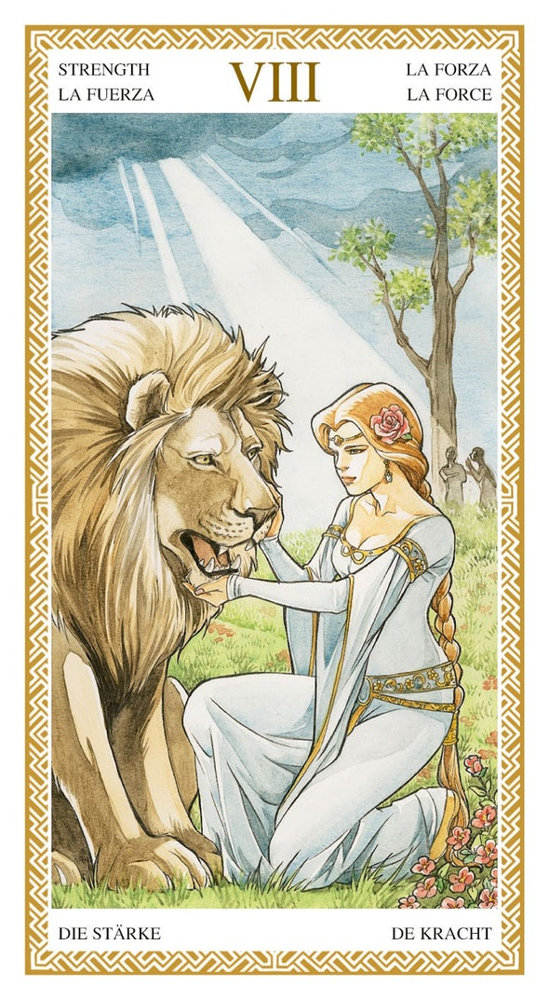
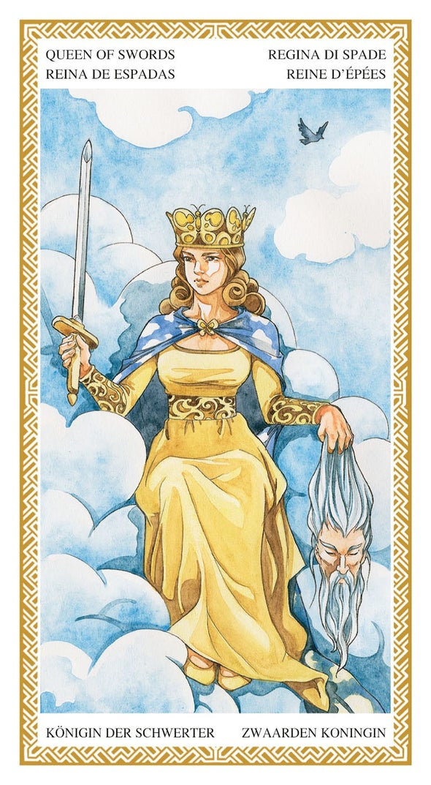
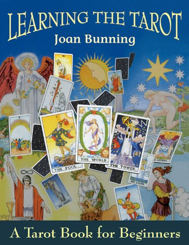
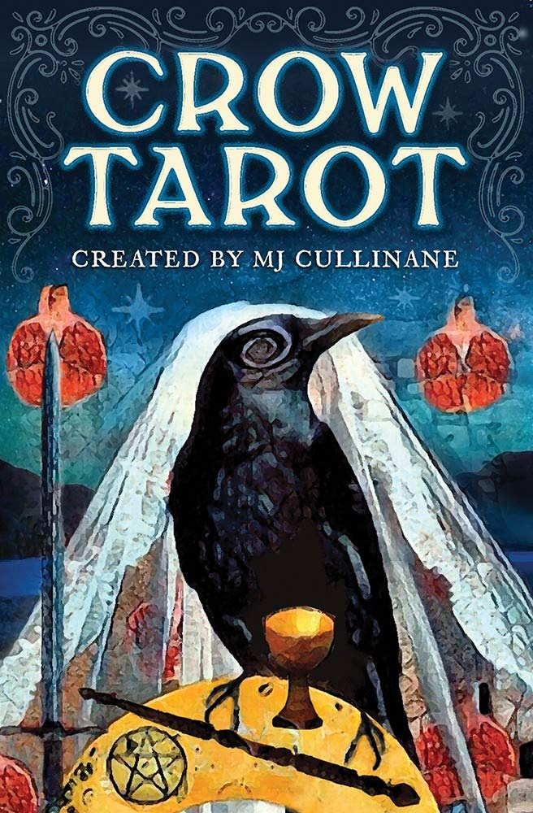
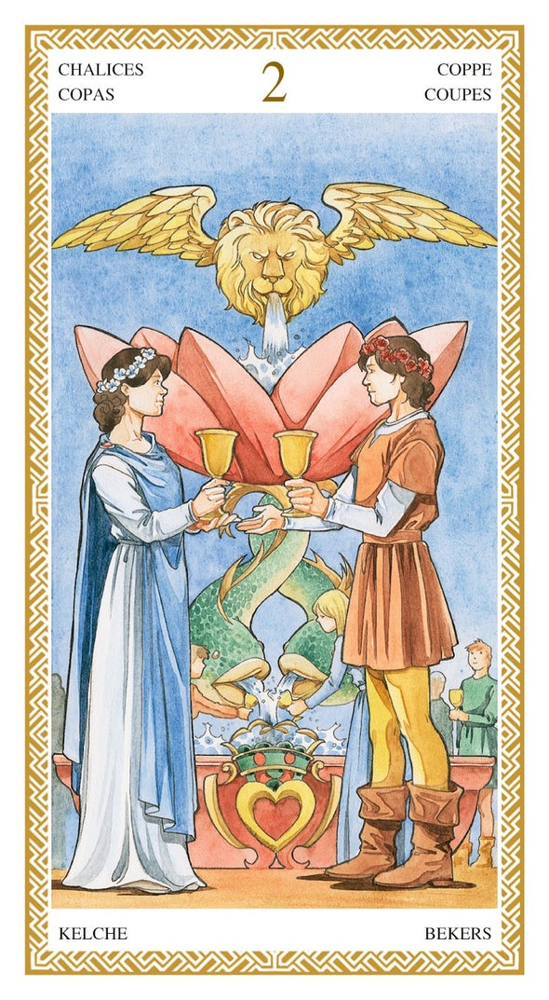

It might surprise you to learn that I've been doing daily [Tarot](https://en.wikipedia.org/wiki/Tarot) for six years! Unlike my other [card](/star-wars-cards/) [collections](/magic-the-gathering), which encourage strategic and analytical thought, Tarot pushes you to listen to your intuition and consider life through a different lens. It even stimulates good conversation!

<div class='fold'></div>

## What is Tarot?

To start, a Tarot deck is 78 cards. First, the four 'minor arcana' suits: wands, cups, swords, and pentacles, each including _Ace_, _Two_ through _Ten_, and the full court: _Knave, Knight_, _Queen_ and _King_. Modern playing cards came from this core set of suits, with the _Knave and Knight_ combined into _Jack_.

The remaining 22 cards are the 'major arcana': a set of human archetypes usually described as the "Fool's Journey." It starts with innocence and perhaps folly in _The Fool_ (precursor to _The Joker_ in modern playing cards), progressing through the ups and downs of adventure and personal growth all the way to sweeping fulfillment in _The World_.

Here is where Tarot really departs from playing cards: each deck is filled with often beautiful, sometimes shocking, but always thought-provoking art. Each deck has its own themes, but most include a variety of elements per card to provide handholds for intuition. Each element of the art can take your mind in a different direction, and close inspection can often yield details which escaped your initial look.

[](https://www.loscarabeo.com/en/products/tarocchi-lo-scarabeo)

## What is it for?

Depending on who you talk to, Tarot is about _prediction_, _explanation_, _inspiration_, _connection_, or perhaps just _observation_.

Let's go a level deeper:

* _Prediction_ - it will give you hints about the future, things that will happen to you or in the world around you.
* _Explanation_ - it will help provide understanding and give meaning to things that have happened already.
* _Inspiration_ - it will spur new thoughts and ideas, enhancing creativity.
* _Connection_ - it will build bridges between people, via the deeper conversation it initiates.
* _Observation_ - it will provide a new perspective for looking at decisions, situations or the world as whole.

Since February 2016 when I bought my first deck, I've done a one-card reading most days. I shuffle my deck, then draw a card, then consider it.

Sometimes the card I draw has felt _explanatory_, like it very clearly describes the state of mind I've been in lately, or things that have happened. Other times it has felt quite _predictive_, like the day I drew _The Tower_, then later that day my partner missed a flight back to Seattle.

But most of the time my daily reading assists in _observation_, giving me a human archetype as a lens I can apply in any situation. Cards like _The Lovers_ or _The Hierophant_ can make you take a second look at your context, your beliefs - perhaps you're not living up to your ideals? Cards like _Nine of Wands_ and _Ten of Wands_ can get you thinking about your energy levels - perhaps you're pushing too hard?

[](https://www.loscarabeo.com/en/products/tarocchi-lo-scarabeo)

## Core themes

Many cards are self-explanatory, with enough cues in the art to provide an initial layer of understanding. But there are some key symbols and archetypes you'll need to know, or some cards will seem meaningless. Your intuition probably isn't enough to decipher a hand reaching through the clouds holding a tree branch or sword.

The four suits each have themes underlying all of their cards:

* _Wands (or rods)_ - boldness, creativity, passion, fire
* _Cups_ - intuition, emotion, compassion, water
* _Swords_ - intellect, truth, justice, air
* _Pentacles (or coins)_ - productivity, wealth, health, earth

The five face cards each have themes:

* _Ace_ - often shown as a hand reaching through the clouds, presenting the suit's namesake. An opportunity to show or acquire the values of the suit arises!
* _Knave (or page)_ - young, often feminine, an innocent enthusiasm for the values of the suit
* _Knight_ - roughly teenage, often masculine, a growing strength in the values of the suit, but lacking finesse and balance. Sometimes talented, sometimes going overboard.
* _Queen_ - advanced expression of the values of the suit, but from a more feminine source.
* _King_ - advanced expression of the values of the suit, but from a more masculine source.

Just with these, you can start to imagine what the _Knight of Wands_ might be like, or the _Queen of Swords._

Simple rules no longer apply for the rest of the cards. _Two_ through _Ten_ are quite different per suit, and each of the 22 'major arcana' have their own distinct meaning. The good news is that for these cards, the art and name alone are often enough to get quite a lot of the meaning.



## Going wider

We've covered the suits and the court cards, and we have our intuition for the rest. You really can get a lot out of Tarot just by looking at the art on the card and seeing what pops out at you in the moment. The general feel of the piece, the overall colors used. The expressions on faces. The overall situation being depicted vs. the small details in the art.

But as with all art, it helps to get additional perspectives. I found [Joan Bunning's Learning the Tarot](https://www.amazon.com/Learning-Tarot-Book-Beginners/dp/1578630487) to be invaluable in providing additional depth beyond my intuitions. It's got a set of lessons covering things like the history of Tarot, deeper meanings for the suits, and how to do basic readings. It's really great for beginners.

But even after all my time with Tarot, I still find the section detailing each card to be valuable. In addition to a few paragraphs of prose and some opposing/reinforcing cards, she provides three to five keywords covering the primary directions you might take the interpretation of a given card. And for each of those keywords, a set of phrases to help give life to the keyword. It's a great mnemonic device given so many different cards in a Tarot deck!

For example, for _Three of Pentacles_ these are the three keywords:

* Teamwork
* Planning
* Competence

Especially when doing larger readings, I still refer back to the card references in this book.

## Going deeper

A daily reading is really useful for getting a feel for the cards. But Tarot really shines when you start to look at multiple cards at once.

To do this, we enter the world of _spreads_. There are many, most specifying multiple cards and their conceptual and physical relation to each other. But there are a few basic _spreads_ most people start with. A simple one I like to use has four slots:

1. Past or foundation
2. Present
3. Future
4. Overall lesson or outcome

Just this arrangement of four gives us a number of contrasts we can consider: past vs. future, present vs. outcome, etc. Given the various interpretations within the art of each card, and the framing in this _spread_, you can start to see how we're letting our mind churn over a lot of potential ideas.

I find that doing a reading like this usually results in some great conversation. So much to discuss!

This is especially true when you provide a prompt to give context to the reading. Your prompt can focus a reading on anything: a difficult problem you've been having, a specific time period, or a person in your life. Now when you think through all the ideas and contrasts presented by the reading, they have a focal point.

Now we're really cooking!

The classic _spread_ is the [Celtic Cross](https://www.biddytarot.com/how-to-read-the-celtic-cross-tarot-spread/):

1. Present environment
2. What is helping or hindering the present environment
3. Root cause, unconscious influence
4. Past/Receding
5. Goal, purpose, conscious attitudes/beliefs
6. Future/Approaching
7. You, as you are or see yourself
8. You as others see you, or the environment
9. Guidance, key/overlooked factor
10. Outcome

These ten slots have even more contrasts: unconscious vs. conscious, present environment vs. what is helping or hindering, and so on. It's a rich tapestry to consider with a friend or loved one. You'll understand yourself better, as well as the others trying to interpret it with you!

Just search for 'Tarot spreads' and you'll find a world of creative and interesting spreads, setting up new relationships between the cards, new layers of meaning. You can go as deep as you want.

[](https://www.mjcullinane.com/crow-tarot)

## My Decks

I made a mistake when starting out. I bought the wrong deck.

There are three main traditions within Tarot: _[Tarot de Marseille](https://en.wikipedia.org/wiki/Tarot_of_Marseilles)_ (more like playing cards), _[Rider-Waite](https://en.wikipedia.org/wiki/Rider%E2%80%93Waite_tarot_deck)_, and _[Thoth](https://en.wikipedia.org/wiki/Thoth_tarot_deck)_ (quite abstract and mystical). Beyond that, there are a lot of highly artistic decks that only loosely follow these traditions.

For a beginner, I would recommend _Rider-Waite_ or something very similar. Though other decks may have great art, this traditional choice is your best option. Just about all beginner content uses _Rider-Waite_ as a reference - you can see examples of the classic art in the book cover above.

I didn't go with _Rider-Waite_, however:

* _Feb 2016, [Art Nouveau](https://www.loscarabeo.com/en/products/i-tarocchi-art-nouveau)_ - My first deck. The art was beautiful, but it diverged too much from _Rider-Waite_ and so wasn't a good learning deck. Beyond that, many of the cards lacked the visual complexity to provide intuitive handholds.
* _March 2016, [Secret Tarot](https://www.loscarabeo.com/en/products/i-tarocchi-dei-segreti)_ - This second attempt was an improvement, with more visual complexity. But I still needed something with more _Rider-Waite_ influence.
* _May 2016, [Lo Scarabeo](https://www.loscarabeo.com/en/products/tarocchi-lo-scarabeo)_ - It was 'the charm!' This deck has beautiful, detailed art inspired by all three of the major Tarot traditions, which you can see in images in this post. It's perfect for me. I'm actually on my second copy - the first one got too dirty!
* _February 2020, [Crow Tarot](https://www.mjcullinane.com/crow-tarot)_ - This is fun to have around, since I love crows. It diverges from _Rider-Waite_ quite a bit, and doesn't have quite the visual complexity _Lo Scarabeo_ does, so I don't use it as often.

Of course, you should find a deck that works for you! Just remember to do your research - sometimes the art in the select previews provided don't match the rest of the deck.

Lastly, know that good sleeves for Tarot cards are hard to come by. As a _[SWCCG](/star-wars-cards/)_ and _[Magic](/magic-the-gathering/)_ player, I'm used to high quality sleeves that fit perfectly - but that does not exist in the world of Tarot! Strange that the company making 66x120mm Tarot cards sells [70x120mm sleeves](https://www.loscarabeo.com/en/products/bustine-protettive-per-tarocchi?_pos=1&_sid=a73d5c86b&_ss=r). I don't want 4mm of unused plastic sleeve!

## Code

You know me, of course I wrote some code to help me with this hobby! I open-sourced my [thoughts-system](https://github.com/scottnonnenberg/thoughts-system) repository years ago now, but I only just added my [`find_tarot`](https://github.com/scottnonnenberg/thoughts-system/commit/b47e13574e1ac5dc2308daca731d30b55dfb08f2) script to it. I wrote the script back in 2016 as I started my daily practice, but I didn't want to open-source it without a good introduction. Finally, with this introduction comes my little script.

The idea is that you use the [Tarot templates provided](https://github.com/scottnonnenberg/thoughts-system/blob/b47e13574e1ac5dc2308daca731d30b55dfb08f2/info/tarot-templates.txt) in the plaintext [daily log files generated by `log.sh`](https://github.com/scottnonnenberg/thoughts-system#generation-scripts) and then you can run `find_tarot`:

```
> find 2022/02_February | grep log\.txt$ | xargs ./find_tarot –single
** By Frequency
3 Ace of Pentacles
2 The Fool (rank: 0)
2 Temperance (rank: 14)
2 The World (rank: 21)
1 The High Priestess (rank: 2)
1 Justice (rank: 8)
<snip>

** By Name
2 The Fool (rank: 0)
1 The High Priestess (rank: 2)
1 Justice (rank: 8)
1 The Hermit (rank: 9)
1 The Wheel (rank: 10)
1 Death (rank: 13)
<snip>

** By Suit
13 Major Arcana (10 unique)
2 Wands (2 unique)
5 Chalices (5 unique)
4 Swords (4 unique)
6 Pentacles (4 unique)
```

I hope it helps you to get a bird's-eye view of your regular Tarot practice. I know for me it's a fun and instructive script to run at the end of the month!

[](https://www.loscarabeo.com/en/products/tarocchi-lo-scarabeo)

## Conclusion

Tarot has been a fun and mind-expanding hobby over the past six years. I definitely plan to continue my single-card daily readings and periodic larger readings. And who knows, perhaps I'll expand into another new deck at some point!

Maybe Tarot could be a fun new lens on the world for you as well? Grab a beginner book and deck, and see how it feels!

If that's too much, try getting a reading from a professional. It's quite an experience!
